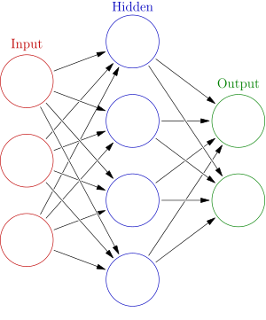

Artifical Neural Network
=================

Artificial neural networks is a type of statistical learning algorithm that is inspired by biological neural networks (the central nervous systems of animals, in particular the brain) and are used to estimate or approximate functions that can depend on a large number of inputs and are generally unknown. Artificial neural networks are generally presented as systems of interconnected "neurons" which can compute values from inputs, and are capable of machine learning thanks to their adaptive nature.

General Neural Network

This is a general case neural network.

To start things off, you need to declare the architecture of your neural network. 
To construct a "topology" aka the architecture of the neural network,
simple assign the vector<unsigned> to the vector of values you desire.

For example:

<tt>
  vector<unsigned> topology (2,4,3,2);
</tt>

will create a neural network with 2 input nodes, 2 hidden layers with 4 and 3 nodes, respectively,
and an output layer of 2 nodes.

The declaration of a nerual network, called a Net, requires 2 parameters, a topology,
as well as a transfer function.

A transfer function maps the output of a neuron to a set of values. Generally the range
of the values is [-1, 1] or [0,1]. There are a few ways to achieve this. The first is called 
a sigmoid function. That is: 

<tt>
1/(1+e^x)
</tt>

To be continued when I have more downtime in the lab.
