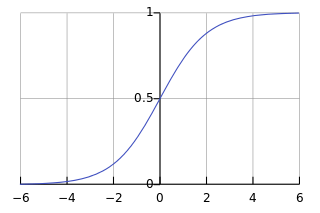

Artifical Neural Network
=================

Artificial neural networks is a type of statistical learning algorithm that is inspired by biological neural networks (the central nervous systems of animals, in particular the brain) and are used to estimate or approximate functions that can depend on a large number of inputs and are generally unknown. Artificial neural networks are generally presented as systems of interconnected "neurons" which can compute values from inputs, and are capable of machine learning thanks to their adaptive nature.

General Neural Network

Each circle represents a Neuron. What a neuron does is sums the inputs of the outputs of the neurons that feed into it multiplied by the weight of the connection, applies a logistical function  to the sum then sends that value to the nodes it is connected to to the right.

A logistic function, also called a transfer function, maps the output of a neuron to a set of values. Generally to the range of the values is [-1, 1] or [0,1]. There are a few ways to achieve this. The first is called 
a sigmoid function. That is: 

<tt>
1/(1+e^x)
</tt>

There are several other logistical functions, here are a few

The derivatives of the logistical functions provided have positive derivatives for all real x. 

The last part of a neural network are the weights that accompany each connection. These weights are the dynamic part of the network. They are adjusted in a process called back propagation in an attempt to generate the proper output given an input for every case of inputs and outputs.

To start things off, you need to declare the architecture of your neural network. To construct a "topology" aka the architecture of the neural network, simply assign the vector<unsigned> to the vector of values you desire.

For example:

<tt>
  vector<unsigned> topology (2,4,3,2);
</tt>

will create a neural network with 2 input nodes, 2 hidden layers with 4 and 3 nodes, respectively, and an output layer of 2 nodes.

The declaration of a nerual network, called a Net, requires 2 parameters, a topology, as well as a transfer function. Proper declaration of a transfer function

<tt>
  string transferfunction = "sig"
</tt>

To be continued when I have more downtime in the lab.
